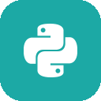

  

  

## About Me

I'm an **AI/ML Engineer, Data Scientist, and Software Engineer** finishing my B.E. in Artificial Intelligence and Data Science at CBIT Hyderabad. I design and ship production-style systems — models that explain their own decisions, pipelines that hold up at scale, and APIs built the way a real engineering team would build them — using open-source stacks with zero paid dependencies.

- 🔬 Explainable AI systems (SHAP, LIME, Grad-CAM) for high-stakes, regulated domains
- 🌊 Graph-based fraud detection at streaming scale (Kafka + PySpark + GNNs)
- 🧠 Full-stack ML — from model training to FastAPI microservices and deployable APIs
- 🏆 Best Use Case Award — SRM-AP Quantum Hackathon (Post-Quantum Cryptography)

 

## Tech Stack

**Languages & Core** &nbsp;  

**ML & Explainability** &nbsp;      

**Data & Streaming** &nbsp;    

**Apps & Infra** &nbsp;    

## Featured Projects

<table>
<tr>
<td width="50%" valign="top">

### 🩺 MediVision AI
Multimodal chest X-ray diagnostic assistant combining ResNet-50 + Grad-CAM visual reasoning with a BioBERT-powered RAG layer for clinical context.
  
`ResNet-50` `Grad-CAM` `BioBERT` `ChromaDB` `Ollama Mistral-7B` `Docker`

</td>
<td width="50%" valign="top">

### 🌊 Real-Time Fraud Detection Pipeline
Streaming fraud detection using heterogeneous graph neural networks over transaction graphs, with SHAP explainability layered on top.
  
`Kafka` `PySpark` `PyTorch Geometric` `HeteroGraphSAGE` `SHAP` `Streamlit`

</td>
</tr>
<tr>
<td width="50%" valign="top">

### 📑 RAG Financial Policy & Compliance Assistant
Hybrid retrieval assistant combining BM25 and dense embeddings with cross-encoder reranking to answer compliance queries against policy documents.
  
`ChromaDB` `BAAI Embeddings` `CrossEncoder` `OpenRouter (Qwen)` `Streamlit`

</td>
<td width="50%" valign="top">

### 🧪 Clinical Trial Dropout Prediction
Predicts patient dropout risk in clinical trials using CDASH-style synthetic data, with careful data-leakage auditing and dual explainability.
  
`LightGBM` `Logistic Regression` `SHAP` `LIME`

</td>
</tr>
</table>

## Certifications

- **AWS Certified CloudOps Engineer – Associate**
- **IBM Enterprise Data Science**
- **Oracle AI Foundations Associate**
- **Business Analytics** — Skill India (NSDC)

 

## What Drives Me

I'm drawn to problems where an AI system's decision needs to be trusted, not just accurate — that's what pulls me toward explainability and responsible AI. I like working across the full stack of a problem: framing it, training the model, and then building the engineering around it that makes it usable in the real world. Longer-term, I'm working toward a PhD, and eventually building something of my own in deep-tech.

 

