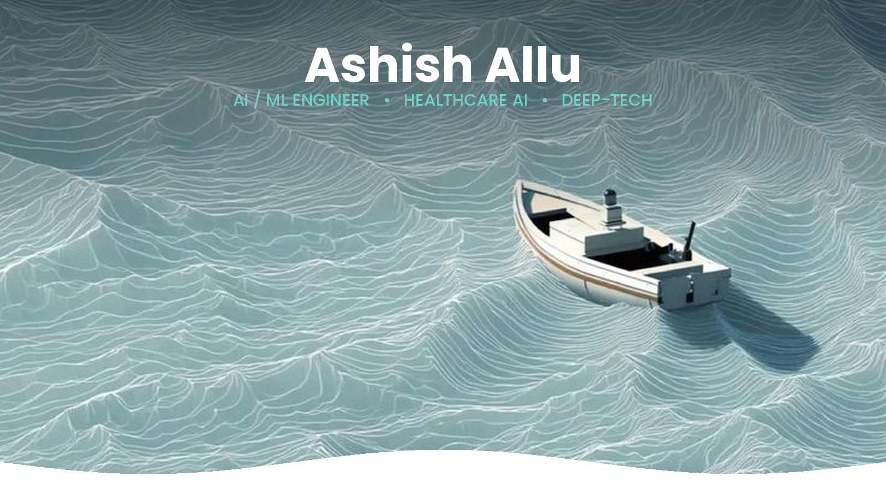

  

  

## About Me

I'm an **AI/ML Engineer, Data Scientist, and Software Engineer** finishing my B.E. in Artificial Intelligence and Data Science at CBIT Hyderabad. I design and ship production-style systems — models that explain their own decisions, pipelines that hold up at scale, and APIs built the way a real engineering team would build them — using open-source stacks with zero paid dependencies.

- 🔬 Explainable AI systems (SHAP, LIME, Grad-CAM) for high-stakes, regulated domains
- 🌊 Graph-based fraud detection at streaming scale (Kafka + PySpark + GNNs)
- 🧠 Full-stack ML — from model training to FastAPI microservices and deployable APIs
- 🏆 Best Use Case Award — SRM-AP Quantum Hackathon (Post-Quantum Cryptography)

 

## Tech Stack

**Languages & Core**
 
   

  

**Machine Learning & Explainability**
 
      

  

**Data, Retrieval & Streaming**
 
    

  

**Apps & Infrastructure**
 
    

## Highlights

- 🕸️ Engineered a real-time fraud detection pipeline over streaming transaction graphs — Kafka + PySpark + heterogeneous GNNs, fully explained with SHAP
- 📑 Built a hybrid-retrieval RAG assistant (BM25 + dense embeddings + cross-encoder reranking) for financial compliance Q&A
- 🩺 Shipped a multimodal diagnostic assistant combining ResNet-50 + Grad-CAM visual reasoning with a BioBERT-powered RAG layer
- 🧪 Found and fixed a subtle data-leakage bug in a clinical trial model, then tuned it for real-world reliability
- 🏆 Directed a national-scale hackathon as Events Head, CBIT Student Technical Association
- 🌍 Every project shipped fully open-source, zero paid dependencies — data pipeline to deployed demo

<a href="https://github.com/ashishallu?tab=repositories">See the code on GitHub →</a>

## Certifications

- **AWS Certified CloudOps Engineer – Associate**
- **IBM Enterprise Data Science**
- **Oracle AI Foundations Associate**
- **Business Analytics** — Skill India (NSDC)

 

## What Drives Me

I'm the kind of engineer who reads the SHAP values before celebrating the accuracy score — I want to know *why* a model decided what it decided, not just that it got there. That curiosity is what pulls me toward explainable and responsible AI, and it's why I like sitting close to the whole problem: framing it, training the model, then building the engineering around it that makes it trustworthy enough to actually use. I'm energized by systems where the stakes are real — fraud, healthcare, compliance — the kind of domains where getting it right actually matters. Long-term, that same curiosity is pointed at a PhD, and eventually, building something of my own in deep-tech.

 

